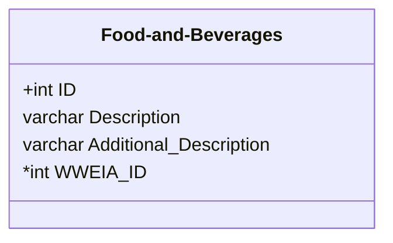
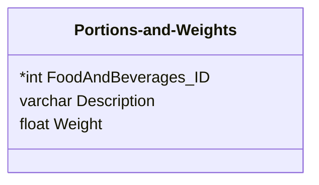
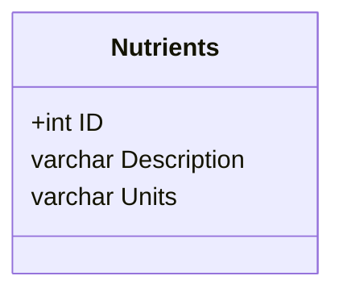
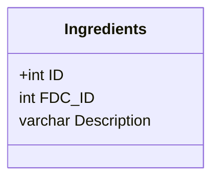
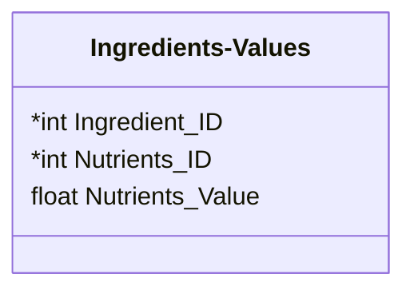
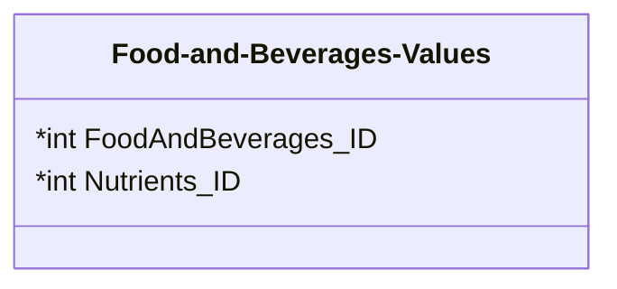
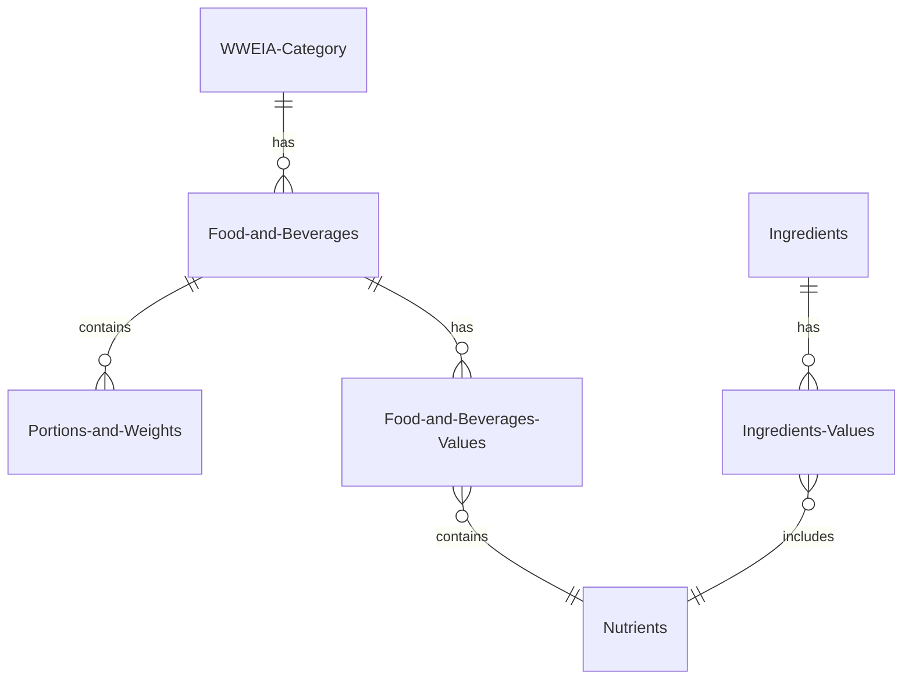

Project Preparation
---
# Preliminaries
See [[lecture01-sql-rehearsal.pdf#page=3]] for presentation description:
![[lecture01-sql-rehearsal.pdf#page=3]]

## Application Idea
**Meal nutrition helper**
* The subject is nutrition: the user can use the app to select various meals and get the nutrition content of them in general, and by ingredient.
* The user enters their age group and gender, and then the meals eaten during the day.
* The application will calculate nutritional info per-nutrient, per-meal and overall, and output a "health-score", based on the FDA's recommended intake amount per nutrient.

## Data
### References
The datasets were taken from the US Department of Agriculture (USDA), and the US Food and Drug Administration (FDA) - which is a US federal agency of the Department of Health.
* [FNDDS](https://www.ars.usda.gov/northeast-area/beltsville-md-bhnrc/beltsville-human-nutrition-research-center/food-surveys-research-group/docs/fndds-download-databases/)
	* [At a glance](https://www.ars.usda.gov/ARSUserFiles/80400530/pdf/fndds/2021_2023_At_A_Glance.pdf)
	* [Content of Datasets](https://www.ars.usda.gov/ARSUserFiles/80400530/pdf/fndds/2021_2023_Contents_of_Datasets.pdf)
	* Food and Beverages
	* Portions and Weights
	* FNDDS Ingredients
	* Ingredient Nutrient Values
	* FNDDS Nutrient Values
* [FDA RDIs - Nutrients](https://www.fda.gov/media/99069/download)
* [FDA RDIs - Food Components](https://www.fda.gov/media/99059/download)

### Which Part of the Dataset?
#### Food and Beverages
* **Food code**
	* Unique 8-digit identification number
* **Main food description**
	* Primary description for a food code
* **Additional food description**
	* Description(s) associated with a food code/main description
* **WWEIA Category number**
	* Unique 4-digit identification number
* **WWEIA Category description**
	* Description for a WWEIA category

#### Portions and Weights
* **Food code**
	* Unique 8-digit identification number
* **WWEIA Category number**
	* Unique 4-digit identification number
* **Portion description**
	* Unit of measure
* **Portion weight**
	* Edible portion in grams (g)

#### FNDDS Ingredients
* **Food code**
	* Unique 8-digit identification number
* **Main food description**
	* Primary description for a food code
* **WWEIA Category number**
	* Unique 4-digit identification number
* **Ingredient code**
	* NDB number or FNDDS food code
* **Ingredient description**
	* Description of NDB number or FNDDS food code
* **Ingredient weight**
	* Edible portion in grams (g)

#### Ingredient Nutrient Values
* **Ingredient code**
	* NDB number or FNDDS food code
* **Ingredient description**
	* Description of NDB number or FNDDS food code
* **Nutrient value**
	* Amount per 100g edible portion for energy and 64 nutrients
* **FDC ID**
	* Identifier of food in FoodData Central

> [!info] Note:
> It is possible to use the FDC ID for the USDA FoodData Central website, in the following way: ```f"https://fdc.nal.usda.gov/food-details/{FDC ID}/nutrients"```.

#### FNDDS Nutrient Values
* **Food code**
	* Unique 8-digit identification number
* **WWEIA Category number**
	* Unique 4-digit identification number
* **WWEIA Category description**
	* Description for a WWEIA category
* ***Value for each nutrient***
	* Amount per 100g edible portion for energy and 64 nutrients

## Database Schema

### WWEIA-Category
* **ID**
* Description
```plantuml-svg
entity "WWEIA-Category" {
    + ID : int
    Description : string
}
```
### Food-and-Beverages
* **ID**
* Description
* Additional_Description
* *WWEIA_ID*
```plantuml-svg
entity "Food-and-Beverages" {
    + ID : int
    Description : string
    Additional_Description : string
    * WWEIA_ID : int
}
```

### Portions-and-Weights
* *FoodAndBeverages_ID*
* Description
* Weight
```plantuml-svg
entity "Portions-and-Weights" {
    * FoodAndBeverages_ID : int
    Description : string
    Weight : float
}
```

### Nutrients
* **ID**
* Description
* Units
```plantuml-svg
entity "Nutrients" {
    + ID : int
    Description : string
    Units : string
}
```

### Ingredients
* **ID**
* FDC_ID
* Description
```plantuml-svg
entity "Ingredients" {
    + ID : int
    FDC_ID : int
    Description : string
}
```

### Ingredients-Values
* *Ingredient_ID*
* Nutrients_ID
* Nutrients_Value
```plantuml-svg
entity "Ingredients-Values" {
    * Ingredient_ID : int
    * Nutrients_ID : int
    Nutrients_Value : float
}
```

### Food-and-Beverages-Values
* *FoodAndBeverages_ID*
* Nutrients_ID (VALUE FOR EACH NUTRIENT, there are many to include: e.g. Energy, Protein, etc..)
```plantuml-svg
entity "Food-and-Beverages-Values" {
    * FoodAndBeverages_ID : int
    * Nutrients_ID : int
}
```

### Complete Diagram
```plantuml-svg
entity "WWEIA-Category" {
    + ID : int
    Description : string
}

entity "Food-and-Beverages" {
    + ID : int
    Description : string
    Additional_Description : string
    * WWEIA_ID : int
}

entity "Portions-and-Weights" {
    * FoodAndBeverages_ID : int
    Description : string
    Weight : float
}

entity "Nutrients" {
    + ID : int
    Description : string
    Units : string
}

entity "Ingredients" {
    + ID : int
    FDC_ID : int
    Description : string
}

entity "Ingredients-Values" {
    * Ingredient_ID : int
    * Nutrients_ID : int
    Nutrients_Value : float
}

entity "Food-and-Beverages-Values" {
    * FoodAndBeverages_ID : int
    * Nutrients_ID : int
}

"WWEIA-Category" ||--o{ "Food-and-Beverages" : has
"Food-and-Beverages" ||--o{ "Portions-and-Weights" : contains
"Food-and-Beverages" ||--o{ "Food-and-Beverages-Values" : has
"Food-and-Beverages-Values" }o--|| "Nutrients" : contains
"Ingredients" ||--o{ "Ingredients-Values" : has
"Ingredients-Values" }o--|| "Nutrients" : includes
```

# Milestones

> [!info] Note:
> The majority of the work will be performed together by the two partners, with some parts to be split when necessary (TBD).

1. Schema design and migration from obtained dataset
	1. Design DB schema, as described
	2. Populate the DB from the obtained dataset
2. Design minimal working logic for the application
	1. Connect to the DB using Python
	2. Develop backend for application
3. Develop a UI and modify current code
	1. Design a web UI
	2. Interface with the developed backend
